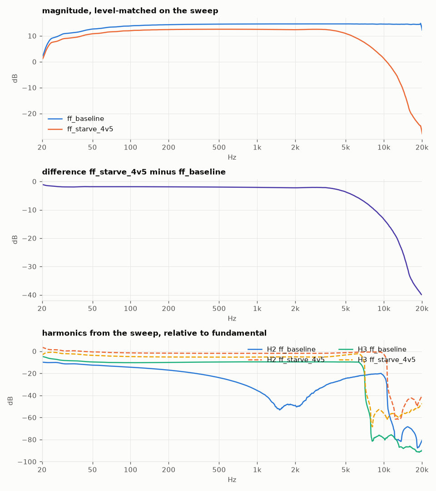
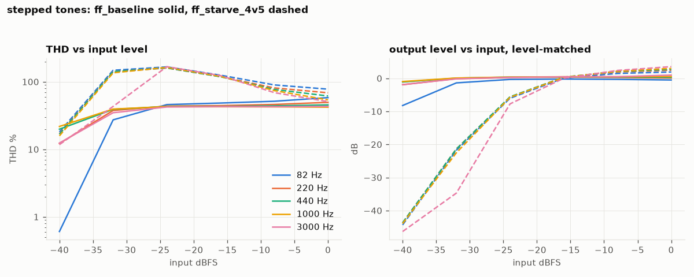
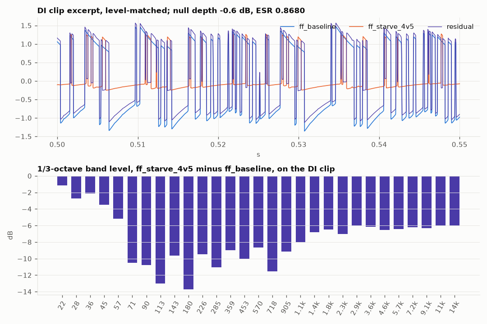
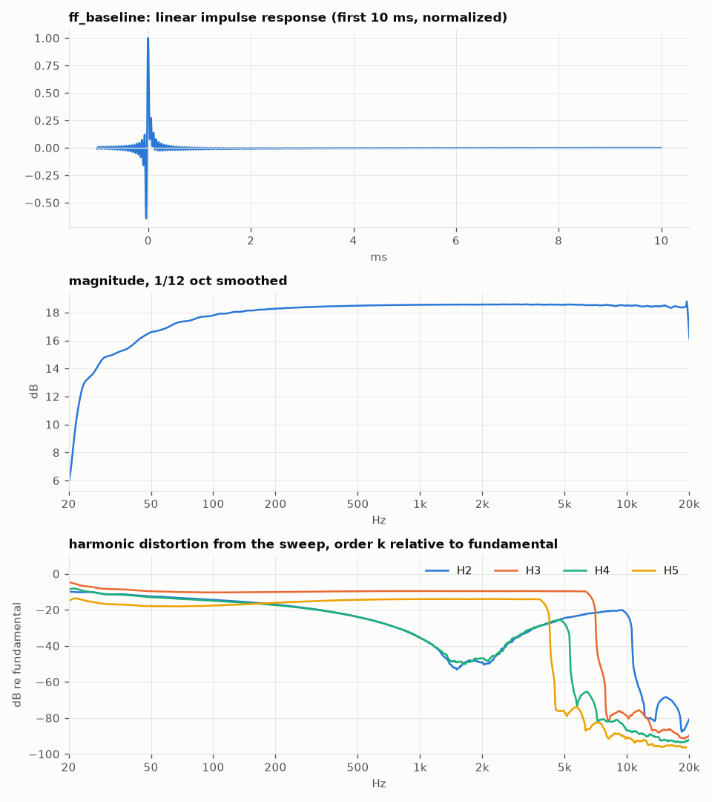
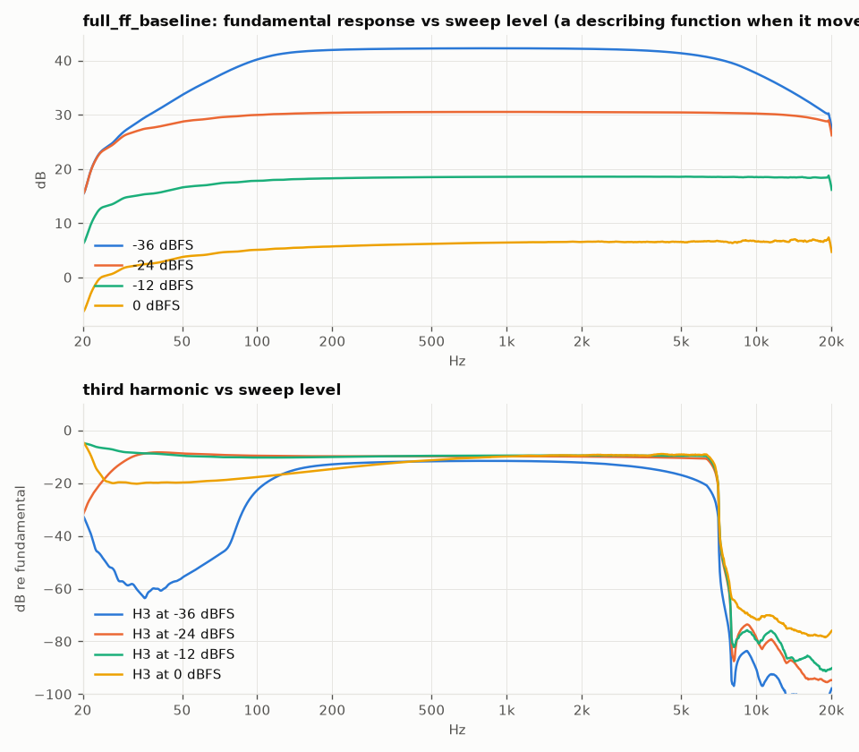
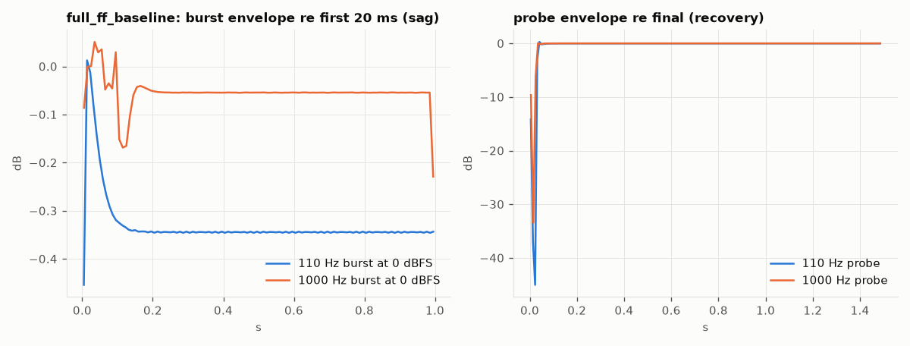
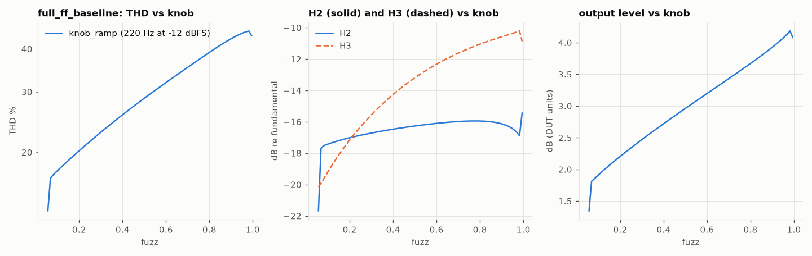
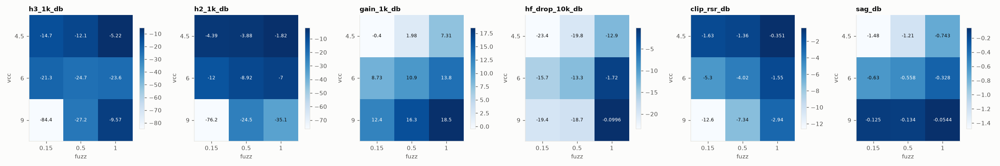
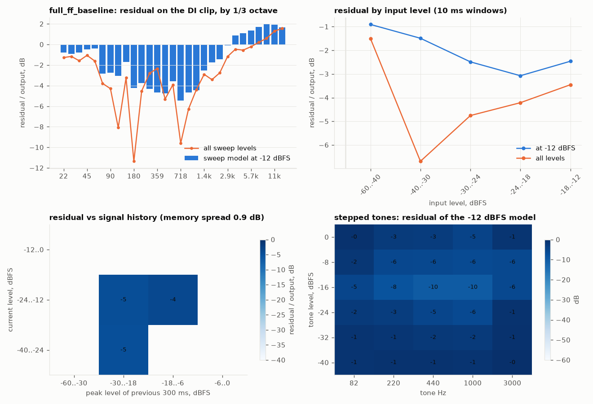

# ir-harness

A round-trip audio measurement harness. One stimulus goes into a device under
test, the response comes back, gets aligned, measured, and compared against
any other device's response on the same axes. The device can be a circuit
simulation, a fuzz pedal, a tube amp into a load box, or an audio interface
looped back on itself. The harness doesn't care, and that is the whole point.

```
irh gen -o stim/default --sweep-dbs=-36,-24,0 --di my_guitar_di.wav
irh run --stim stim/default --dut sim:ff --ramp fuzz:0.05:1@knob_ramp -o runs/sim_fuzzface
irh run --stim stim/default --dut audio:3:3 --out-db -12 -o runs/real_fuzzface
irh compare runs/sim_fuzzface runs/real_fuzzface -o compare/sim_vs_real
irh grid --stim stim/default --dut sim:ff --grid fuzz=0.15,0.5,1 --grid vcc=9,6,4.5 -o runs/knobs
```

Every run also fits a nonlinear model to its own sweep, predicts the DI clip
with it, and reports where the prediction fails: by frequency, by input
level, by signal history, per tone. That residual is the harness's compass.
It says which mechanism the measurement is missing before anyone guesses.

Status: the software half is built and tested against closed-form answers.
The hardware half has an adapter but no hardware on the bench yet.

---

## 1. What this is for

### The problem

[circuit-decimator](https://github.com/audiodestrukt/circuit-decimator) is a
component-level circuit simulator for guitar electronics: a Fuzz Face and a
Shin-Ei FY-2 solved with the nodal DK method in realtime, plus tube stages,
output transformers with Jiles-Atherton cores, and an LA-2A. Every one of those
models has been validated the same way: the realtime solver is checked against
ngspice running the same netlist. That proves the solver integrates the
equations correctly. It proves nothing about whether the equations describe the
box on the shelf.

Nothing in that repo has ever been compared to a measured signal. This harness
exists to fix that, and to keep it fixed as the modeling gets more ambitious.

### The larger goal

The target that motivates the work is a vintage Marshall JMP. The plan is to
model it exhaustively: not one snapshot at one knob setting, but the whole
control surface, and not just "does it sound close" but "which physical
mechanism is responsible for which audible trait". Getting there needs a
measurement bench that can treat the real amp and the model as interchangeable,
so the difference between them is a number you can drive down.

Beyond the JMP, three questions this bench should be able to answer:

1. **Where do white-box circuit models fail against reality, and why?** A
   model that matches the linear response but misses the third harmonic at
   high drive has a specific bug (a wrong device curve, a missing parasitic).
   A measurement that separates linear, harmonic, and level-dependent behavior
   points at the mechanism.

2. **How does this approach compare with black-box capture, specifically
   [Neural Amp Modeler](https://github.com/sdatkinson/neural-amp-modeler)?**
   NAM trains a WaveNet or LSTM on a DI / reamp pair and reports
   error-to-signal ratio. It captures one knob setting, has no physical
   parameters, and can't extrapolate to a setting it wasn't trained on. A
   circuit model has parameters that mean something and covers the whole
   control surface, but only if the parameters are right. The interesting
   territory is between them: measurement-fitted circuit models, or structured
   nonlinear models (Hammerstein and Volterra families) built directly from the
   harmonic impulse responses this harness already extracts. Whether any of
   that is novel is a question for a proper prior-art scan, not a README, but
   the measurement side is a precondition for finding out.

3. **What gives a piece of gear its presence in a finished mix?** Reference
   recordings made on vintage hardware exist. The psychoacoustic question is
   which measurable properties (harmonic structure, compression behavior,
   dynamic frequency response, noise) carry the trait a listener identifies,
   and which are inaudible once mastered. That needs the same measurement
   vocabulary applied to models, hardware, and recordings alike.

### What the first pass deliberately leaves out

Scope was set at kickoff (see `BRIEF.md`) and these are parked, not forgotten:

- **Instrument control.** The Rigol scope and analyzer on hand are not USB.
  The design has a slot for instruments (a DUT is any object with `run()`;
  a scope is just a second observer) but nothing is wired.
- **Motorized knobs.** Knob positions are recorded as parameters on a run;
  turning them is manual for now.
- **The NAM comparison itself.** The harness reports NAM's ESR metric so
  the comparison is apples to apples when it happens.
- **A JMP circuit model.** circuit-decimator already has the building blocks
  (a tube stage, a single-ended output stage with a hysteretic transformer),
  so this is assembly, later.
- **Mic'd cabinets and psychoacoustics.** Both need the line-level loop
  closed first.

---

## 2. Design

### One stimulus, many devices

The harness is built around one idea: a **stimulus** is a single long signal
made of named **segments**, and the segment table travels with the signal.
A DUT receives the whole signal and returns a response. Analysis aligns the
response to the stimulus once, then cuts it at the same offsets. Every
measurement is derived from the same recording, so a sim and a hardware run
are directly comparable and nothing depends on which device produced it.

```
stimulus ──► DUT adapter ──► response.wav ──► align ──► aligned.wav ──► analyze ──► metrics.json
                                                                                    analysis.npz
                                                                                    figures
   runs/a ──┐
            ├──► compare ──► report.md, compare.json, figures
   runs/b ──┘
```

### Units

The stimulus is full scale: `|x| <= 1`. What a full-scale sample means in
volts is the adapter's business. Sim adapters take `--volts-per-fs` (default
0.25 V at the circuit input, roughly a hot guitar pickup); the audio adapter
takes `--out-db` attenuation and whatever the interface's output stage does.
Responses stay in whatever units the DUT returned (volts from a sim, full
scale from an interface). Comparison level-matches on the sweep, so absolute
units only matter for setting drive, and the gain difference is reported as
one number rather than hidden.

### Sample rate

Default 192 kHz, the ceiling of the interface here and the native rate of
circuit-decimator's renderers. High rate matters for two reasons: harmonic
IRs of order k need output bandwidth k times the input bandwidth, and hard
clipping produces energy well above 20 kHz that aliases otherwise.

---

## 3. What is implemented

### 3.1 Stimulus (`irharness/stimulus.py`)

`irh gen` builds this sequence. Durations are defaults; all are flags.

| segment | length | purpose |
|---|---|---|
| `pre` silence | 0.5 s | noise floor, DUT settling (a sim's DC operating point, a real box's coupling caps) |
| `sync` chirp | 20 ms | coarse landmark at -20 dB, for eyeballing alignment on a scope or in a DAW |
| `sweep` (or `sweep_<L>dB` per level) | 10 s each | synchronized exponential sine sweep, 20 Hz to 20 kHz. Reference level -12 dBFS; `--sweep-dbs` adds more, quietest first. Each gets a 1 s tail |
| `tone_*` | 5 freqs × 6 levels × 0.25 s | 82, 220, 440, 1000, 3000 Hz at -40, -32, -24, -16, -8, 0 dBFS, 10 ms fades, 0.1 s gaps |
| `knob_ramp` | 4 s | a plain 220 Hz tone at -12 dBFS. Inert by itself; a run attaches a parameter ramp to it |
| `burst_*` / `probe_*` | 2 × (0.5 + 1 + 1.5 + 0.5) s | silence, a 0 dBFS tone burst, then immediately a -30 dBFS probe at the same frequency (110 Hz and 1 kHz). The burst's envelope shows sag setting in; the probe's shows recovery |
| `clip` | up to 20 s | a DI recording, mono-mixed, resampled, peak-normalized to -6 dBFS |
| `post` silence | 0.5 s | release behavior |

About 40 s at defaults, 73 s with three extra sweep levels. Saved as `stimulus.wav` (float32) plus
`stimulus.json` with the segment table and every generation parameter.

The sweep is **Novak's synchronized form** of the Farina exponential sweep:
the rate constant L is rounded so that f1·L is an integer. That makes every
harmonic's impulse response come out of the deconvolution with a
well-defined phase relative to the linear one, which is what lets the
harmonic IRs be reused as a nonlinear model (a generalized Hammerstein) later
rather than just plotted.

### 3.2 DUT adapters (`irharness/dut/`)

A DUT is any object with `run(x, fs) -> y` and `describe() -> dict`. The
description is recorded in `run.json` so a run is reproducible.

| spec | device | notes |
|---|---|---|
| `ident` | pass-through | |
| `gain:<db>` | scalar gain | |
| `delay:<samples>` | pure delay | alignment test fixture |
| `lowpass:<hz>[:order]` | Butterworth | a linear DUT with a closed-form answer |
| `tanh:<drive>` | `tanh(d·x)/d` | odd harmonics with a closed-form small-signal answer |
| `sim:ff` | circuit-decimator Fuzz Face via `ff_render` | `--set` takes the `.param` names from `sim/fuzzface.cir` (`vcc`, `fuzz`, `rc2b`, `bf1`, `rleak1`, …); `--solver mna\|dk\|dkf` |
| `sim:seout`, `sim:shinei` | netlist circuits via `circuit_render` | single-ended output stage, FY-2 fuzz |
| `sim:tubepre` | tube mic pre via `tubepre_render` | `--set linear=1` for an ideal core |
| `plugin:<path.vst3>` | any VST3 via circuit-decimator's `plugin_render` | parameters by display name in their own units |
| `audio:<out_dev>:<in_dev>` | play and record through an audio interface | `sounddevice.playrec`, one call, so output and input share a clock; `--out-channel`, `--in-channel`, `--out-db` |

The sim adapters convert the stimulus to the "time value" text the renderers
read, call the binary, and parse the output node column. They expect
`../circuit-decimator/build` or `$CIRCUIT_DECIMATOR/build`.

The audio adapter is written and untested: there is no interface connected
to this machine yet. `irh devices` lists what `sounddevice` sees.

### 3.3 Alignment (`irharness/align.py`)

Delay is found from the **deconvolved sweep**, not from raw cross-correlation.
The linear IR's peak is a far sharper landmark than the sweep's
autocorrelation, and it survives heavy distortion because the fundamental
still correlates. The search is bounded below (10 ms before nominal) so the
harmonic IRs, which land earlier, can't be mistaken for it. Polarity is the
sign of that peak and is corrected in `aligned.wav`. Delay is integer samples;
sub-sample alignment is a later refinement.

### 3.4 Analysis (`irharness/analysis.py`)

From the sweep:

- **Linear and harmonic IRs.** The aligned response is convolved with the
  inverse sweep. The inverse is normalized so an identity DUT gives a
  passband at 0 dB, so IRs read as output-per-full-scale-input. Order k's IR
  lands `L·ln(k)` seconds before the linear one; each is windowed out with a
  shared pre-window of up to 50 ms. The pre-window matters: band-limiting at
  20 Hz rings symmetrically around t=0 for tens of milliseconds, and cutting
  it off cost 0.6 dB at 100 Hz before this was fixed.
- **Frequency response**, magnitude and unwrapped phase, power-averaged over
  1/12 octave on a log grid.
- **Harmonic response**: for each order k, `|H_k(k·f)| / |H_1(f)|` in dB as a
  function of input frequency f. This is the distortion spectrum at the
  sweep's drive level, across the band, from one measurement.

From the stepped tones:

- Each tone's steady state (30 ms trimmed from each end, truncated to an
  integer number of cycles) is projected onto harmonics 1 through 10.
  Reported per tone: output RMS, DC offset, fundamental amplitude, THD, and
  each harmonic in dB relative to the fundamental. Across levels this is the
  level-dependent picture the sweep can't give: compression, where clipping
  starts, whether the DC point moves with drive.

From the burst and probe pairs:

- **Sag**: output level over the burst relative to its first 20 ms, and the
  minimum. **Recovery**: the probe's level over time relative to its final
  300 ms, the initial deficit, and the time until it stays within 0.5 dB. DC
  offset at the burst's start and end, for bias shift. Windows are an
  integer number of cycles so a steady tone reads steady.

From a knob ramp (`--ramp fuzz:0.05:1@knob_ramp`):

- Short-time level, DC, THD, H2 and H3 of the tone in 50 ms windows,
  against the parameter's value at that moment. A distortion-versus-knob
  curve from one four-second pass.

From any segment, comparing two runs:

- **Residual metrics**: least-squares gain, then NAM's error-to-signal ratio
  `Σ(a - g·b)² / Σa²`, its dB form as null depth, and the 1/3-octave band
  level difference.

From every non-silent segment:

- **Spike count**: isolated single-sample outliers above twice the segment's
  99.9th percentile. Catches solver glitches in a sim, clicks and dropouts in
  a recording. A clean DUT reports zero.

### 3.5 The sweep-derived model and its residual (`irharness/model.py`, `irharness/residual.py`)

The harmonic IRs are converted into a **generalized Hammerstein model**: parallel
branches `x, x², … xᴺ`, each through its own linear filter, following Novak,
Simon and Lotton (2010). With the synchronized sweep the sine-power expansion
gives a frequency-independent triangular system relating measured harmonic
spectra to branch filters, which inverts directly. The order is chosen from
the data (highest harmonic IR above -45 dB re the linear one, capped at 9
because the inversion's condition number grows like (2/A)ᴺ⁻¹), and the
model clamps its input to the amplitude it was fitted at, since a polynomial
says nothing past that and explodes there. With several sweep levels the
kernels are blended per sample by the input's short-time envelope.

The model is exact for a memoryless nonlinearity between linear filters at
the sweep's level, and it is applied to the **entire stimulus**. What it
cannot predict lands in the residual, and `residual.py` localizes it:

| view | what a hot spot means |
|---|---|
| by 1/3-octave band | aliasing above 20 kHz, a too-short IR window, a resonance the sweep level didn't excite |
| by input level (10 ms windows) | level dependence beyond what the sweep levels cover |
| by history: current level × peak of the previous 300 ms | at fixed current level, spread along the history axis is memory: sag, bias recovery, thermal |
| per stepped tone (frequency × level) | the direct map of where the static model fails |
| per burst and probe | the memory effects, measured against the memoryless prediction |

`focus` turns those into ranked advice printed after every run, and
`residual.json` has the numbers. `model.npz` holds the kernels, which are
directly usable as a convolver-style nonlinear model.

### 3.6 Knob control (`irharness/controls.py`, `irh grid`)

A control schedule is `{param: [(time, value), …]}`, attached at run time
because parameter names belong to the DUT. `--ramp name:from:to@segment`
ramps across a stimulus segment; outside the ramp's span the parameter is
whatever `--set` or the device default says. Three ways a DUT honours it:

- **native**: the adapter takes the schedule. `sim:ff` does, through a new
  `--automation` option added to circuit-decimator's `ff_render` that
  re-applies interpolated parameters every 32 samples while keeping the
  circuit's state, the same path the plugin uses for a knob turn.
- **stepwise**: the run is split into pieces with constant parameters,
  each rendered with 0.5 s of pre-roll and stitched. Works for any adapter.
- **prompt**: stepwise, but waits for a human to set the knob between
  pieces. This is how real knobs get turned until there are motors.

`irh grid` runs every combination of `--grid name=v1,v2,…` as its own
analyzed sub-run and writes `surface.md` with one row per cell and, for two
axes, heatmaps of gain, H2, H3, treble loss, sag and the model's clip
residual over the knob plane. `--prompt` makes it pause between cells.

### 3.7 Comparison and report (`irharness/session.py`, `irharness/report.py`)

`irh compare a b` loads both analyses, level-matches on the sweep RMS, and
writes:

- `report.md`: a side-by-side table (DUT and parameters, sweep level, delay,
  polarity, SNR, spikes, H2 and H3 at 1 kHz), difference numbers (level,
  magnitude RMS and max, delay, sweep residual, DI clip residual), a THD table
  by tone, and the figures.
- `compare.json`: the same numbers, machine-readable.
- `fig_cmp_sweep.png`: overlaid magnitude, the difference curve, H2 and H3
  for both.
- `fig_cmp_tones.png`: THD and output level versus input level, solid versus
  dashed.
- `fig_cmp_clip.png`: a 50 ms excerpt of both responses and their residual,
  and the band level difference.

Every run also gets `fig_sweep.png` (IR, magnitude, harmonic distortion) and
`fig_tones.png`.

### 3.8 Tests (`tests/test_harness.py`)

Ten tests, all against closed-form fixtures at 48 kHz with a 3 s sweep:

- segments are contiguous and the signal stays within full scale
- save and load round-trip the stimulus and its segment table
- a 1234-sample delay is recovered exactly; an inverter gets polarity -1 and
  an aligned response equal to the stimulus
- identity gives a flat passband within 0.3 dB from 40 Hz to 10 kHz with
  the IR peak at t=0
- a 2nd-order Butterworth at 1 kHz matches scipy's own frequency response
  within 0.1 dB at 100 Hz and 1 dB at 10 kHz
- `tanh` at drive 2 gives a third harmonic within 1.5 dB of the small-signal
  series prediction (-33.6 dB), no second harmonic above -70 dB, and a tone
  THD within 0.1% of a direct numerical reference
- residual metrics recover a 2x gain exactly and report -20 dB null depth
  for 10% added noise
- the sweep-derived model of `tanh` explains a -20 dBFS tone to better than
  -40 dB and fails a 0 dBFS tone (worse than -10 dB), as a -12 dBFS model must
- with sweeps at -30, -12 and 0 dBFS the level-indexed model brings that
  0 dBFS tone under -20 dB
- burst and probe metrics read zero sag, zero deficit and instant recovery on
  an identity DUT

```
uv venv .venv && uv pip install -e ".[dev]"
.venv/bin/python -m pytest tests
```

---

## 4. First results

circuit-decimator's Fuzz Face at 192 kHz, default stimulus with the repo's
synthetic riff as the DI clip. Full example report: `docs/example_report.md`.

**Realtime solver versus reference.** `sim:ff --solver dk` (what the plugins
run) against `--solver mna` (the reference): level difference 0.00 dB,
magnitude difference 0.00 dB, DI clip null depth **-92 dB**. Whatever is
wrong with the model, it isn't the realtime solver.

**Solver glitches.** The DK solver emits isolated single-sample spikes at
hard clipping edges: 16 of them in the 0 dBFS 440 Hz tone at 192 kHz,
reaching 2.8x the segment's 99.9th percentile. At 48 kHz with no oversampling
the same glitches reach 27 V on a 9 V circuit. Newton hits its iteration cap
on the fast edge. This is a step-size artifact, not a modeling error, and it
was invisible to the sim-vs-ngspice check because ngspice takes variable
steps. It will pollute any sim-versus-hardware residual until fixed upstream.

**Baseline versus battery starved to 4.5 V.** Level drops 9 dB. The
response is flat to 5 kHz then loses 40 dB by 20 kHz. H2 at 1 kHz rises from
-35 dB to -2 dB: the starved circuit is nearly an octave fuzz. THD at -32 dBFS
exceeds 100% because harmonics outweigh the fundamental. The DI clip shows the
bias point drifting with the envelope, the "gated, splatty" behavior the
preset is named for.





**Baseline alone.** The harmonic response panel shows H3 and H5 dominant and
nearly flat across the band (symmetric clipping) with H2 and H4 dipping
around 1.5 kHz. That dip is a testable prediction about the real pedal.



**Sweeps at four levels.** The fundamental response drops 12 dB for every
12 dB of extra drive: the output is fully compressed from -36 dBFS up. With
0.25 V per full scale, even the quietest sweep is 4 mV at the input of a
circuit with 40 dB of gain, so every sweep here is a describing function,
not a small-signal response. The third harmonic at -36 dBFS collapses below
80 Hz, where the input network no longer delivers enough level to clip.



**Bursts.** The 110 Hz burst settles 0.34 dB over 150 ms as the bias point
moves. The -30 dBFS probe that follows a 0 dBFS burst starts 45 dB down and
recovers in 40 ms: the gating behaviour of a fuzz after a loud transient,
measured directly.



**Knob ramp.** The fuzz pot swept 0.05 to 1 over four seconds of a 220 Hz
tone, with ff_render automating the parameter every 32 samples: THD 13% to
44%, H3 rising 10 dB, H2 nearly flat. A distortion-versus-knob curve from
one pass.



**Knob surface.** Fuzz × battery voltage, nine cells, each a full run. At
low fuzz on a fresh battery the circuit is clean (H3 -84 dB) and the sweep
model nulls the DI clip to -12.6 dB. At full fuzz on 4.5 V it is an octave
fuzz (H2 -1.8 dB) with 13 dB of treble loss and 0.7 dB of sag, and the
model explains nothing (-0.35 dB). Table: `docs/example_surface.md`.



**What the residual says.** The sweep-derived model explains only 2.7 dB of
the baseline DI clip, 4.2 dB with all four sweep levels, and every stepped
tone above -16 dBFS is unexplained. Raising the model order from 3 to 9
changes nothing; 13 makes it worse. This is the model class, not the
measurement: a hard clipper's output is close to a square wave, and a square
wave keeps 96% of its energy in harmonics up to the 9th, so an order-9
polynomial cannot null it below about -14 dB by construction. The
level-indexed model reaches -16 dB at the levels where a sweep exists, which
is that ceiling. The way past it is a model with a saturating *shape*
(a Wiener-Hammerstein sandwich, with the static curve fitted from the
multi-level describing functions and harmonic ratios this stimulus already
measures), not more polynomial terms. The residual found that in one run.



---

## 5. What the measurement can and cannot tell you

The open question from the brief, restated so it doesn't get lost.

A sine sweep characterizes the linear response and the harmonic distortion
**at one drive level**. Stepped tones add the level dependence at a handful
of frequencies. Between them they cover what a static nonlinearity wrapped in
linear filters can do, which is most of a fuzz pedal.

What makes a tube amp a tube amp is partly outside that: power supply sag,
bias shift with signal history, recovery time after a transient, and the
speaker's reaction against the output transformer. Those are stateful and
level-dependent, and a sweep averages over them. Two runs can agree on every
number above and still sound different on a chord that lets the supply
recover. The DI clip residual is the catch-all for this, but it's a single
number and doesn't say what the mechanism is.

Multi-level sweeps and tone bursts are now in the stimulus, so the level
picture and the memory picture are measured directly. The residual views
say which of them a given device needs. Still missing: a two-tone
intermodulation segment, and sub-sample alignment. Both are a new segment
and a new metric; nothing else changes.

---

## 6. The hardware plan

Nothing here is built. It's recorded so the software is shaped for it.

**Interface loopback first.** Output cabled to input, `audio:<dev>:<dev>`.
That measures the converters, the round-trip latency, the level calibration
and the noise floor. It is the floor under every later measurement, and the
first place a real signal enters the harness.

**A pedal at line level.** Interface out, through a reamp box (balanced line
to instrument level and impedance), into the pedal, into a DI or a
high-impedance instrument input. circuit-decimator's Fuzz Face and FY-2 are
the natural first targets because the models exist. The comparison is direct:
same stimulus, same units after level match.

**The JMP at line level.** Reamp box into the amp, amp into a reactive load
box or attenuator with a line output, into the interface. This keeps the
cabinet, microphone and room out of the measurement so the residual is about
the amp. A load box with a reactive impedance curve matters: a resistive load
changes how the output stage behaves. Both the reamp box and the load box
still need to be acquired or built.

**Knobs.** Every run records its DUT parameters. For hardware, `irh grid
--prompt` walks the control surface one cell at a time and waits for a hand
on the knob; `--knob-mode prompt` does the same for a ramp, in steps.
Motorized control is a later adapter that takes the same schedule.

**Instruments.** The Rigol scope and spectrum analyzer here are not USB, so
SCPI over LAN or serial is the eventual route. Architecturally an instrument
is a second observer of the same stimulus: it adds columns to a run, it
doesn't change the stimulus or the analysis.

---

## 7. Layout

```
irharness/
  stimulus.py       Segment, Stimulus, synchronized_ess, ess_inverse, build
  align.py          find_alignment, apply_alignment, level_match_gain
  analysis.py       deconvolve, extract_harmonics, smoothed_response, harmonic_response,
                    tone_metrics, burst_metrics, ramp_metrics, residual_metrics, spike_metrics
  model.py          sine_power_matrix, fit_hammerstein, choose_order, LevelIndexedModel
  residual.py       localize: by_band, by_level, by_history, by_tone, by_burst, focus
  controls.py       parse_ramp, write_automation, stepwise, run_with_controls
  session.py        run_dut, analyze_run, compare_runs, run_grid, surface
  report.py         figures and the markdown report
  cli.py            irh gen | run | grid | surface | analyze | compare | devices
  dut/
    base.py         the DUT interface
    synthetic.py    ident, gain, delay, lowpass, tanh
    sim.py          circuit-decimator renderers and VST3 host
    interface.py    sounddevice play/record
tests/test_harness.py
docs/               figures and an example report from the first results
BRIEF.md            kickoff brief: problem, done, not-now, first slice, open question
```

A run directory:

```
run.json       DUT spec and parameters, stimulus path, timing, alignment
response.wav   raw output, unaligned, DUT units, float32
aligned.wav    shifted to stimulus time, polarity corrected, stimulus length
metrics.json   alignment, sweep levels and response points, noise/SNR, harmonics at
               1 kHz (per sweep level), spikes, bursts, ramps, model summary and focus,
               every tone's numbers
analysis.npz   fr_f, fr_mag_db, fr_phase, ir_1..ir_N, harm_k_f, harm_k_db (reference level)
model.npz      Hammerstein kernels per sweep level
residual.json  the localized residual, for the reference-level model and for all levels
ir_linear.wav  normalized linear IR, loadable in any convolver
fig_sweep.png, fig_tones.png, fig_residual.png, fig_bursts.png,
fig_levels.png (several sweep levels), fig_ramps.png (a knob ramp)
```

`runs/`, `stim/` and `compare/` are gitignored. A default stimulus is about
30 MB and a run about 100 MB; regenerate them.

### Adding a DUT

Subclass `DUT` in `irharness/dut/`, implement `run(x, fs)` returning a float
array at least as long as `x`, return your parameters from `describe()`, and
add a branch to `make_dut` in `dut/__init__.py`. If the device needs
calibration data (a loopback IR, a level), that belongs in `describe()` too
so it lands in `run.json`.

### Adding a measurement

Add a segment kind in `stimulus.build`, a function in `analysis.py` that
takes `(stim, aligned)` and returns a dict, a line in `analyze_run` that
stores it, and if it's comparable, a line in `compare_runs`. The segment
table means the new measurement gets alignment, units and reporting for free.

---

## 8. Roadmap

1. A saturating-shape model (Wiener-Hammerstein) fitted from the multi-level
   sweeps, so the residual compass has a model that can represent a clipper.
   Its residual against the polynomial's is the first real modeling result.
2. Fix the DK solver spikes in circuit-decimator (iteration cap, step
   control, or oversampling in `ff_render`). Verify with the spike metric.
3. Interface loopback run. Record the floor: latency, level, noise, response.
4. A real Fuzz Face or FY-2 against `sim:ff` / `sim:shinei`. First
   sim-versus-reality residual. Expect the model to be wrong somewhere
   specific, and the residual views to say where.
5. Reamp and load box; the JMP at line level, one setting, then `irh grid
   --prompt` over the control surface.
6. A JMP model assembled from circuit-decimator's tube and output stages,
   fitted against the measurements.
7. NAM capture of the same runs; same stimulus, same ESR, side by side.
8. Prior-art scan on measurement-fitted and Hammerstein-from-sweep modeling
   before claiming anything is new.
9. Mic'd cabinet, reference recordings, and the psychoacoustic question.
